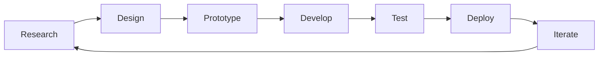

<!-- GitHub Profile README for Atif Anayat -->

# Hi  I'm Atif Anayat

  

  
  

  

---

## 🧠 About Me

> *"I turn ☕ into clean & responsive code - crafting pixel-perfect Flutter experiences."*

I'm a **Flutter Developer** and **Aspiring Full-Stack Engineer** passionate about creating elegant, high-performance mobile applications. Currently working on ERP Flutter Project and learning Web API in ASP.NET Core to expand my full-stack capabilities.

**Core Philosophy:**
- 🎯 **User-Centric Design** — Every interaction should feel natural and delightful  
- ⚡ **Performance First** — Optimize for speed without compromising functionality  
- 🏗️ **Clean Architecture** — Scalable, maintainable, and testable code  
- 🔄 **Continuous Learning** — Stay ahead of the curve with emerging technologies  

---

## 🛠️ Technical Expertise

### **Primary Stack**

### **Programming Languages**

### **Development Tools**

---

## 📊 GitHub Analytics

  
  

---

## 🌟 Current Focus

| 📖 **Learning** | 📈 **Building** | 🚀 **Goals** |
|:---|:---|:---|
| - Web API in **ASP.NET Core**   - Advanced **Flutter State Management**   - **RESTful API** Integration   - Database **Design & Optimization** | - **ERP Flutter Project** (Full System)   - **AI Chatbot** with Flutter + Free AI APIs   - Cross-platform **Notes App** with Firebase   - Personal **Developer Portfolio** | - Master **Full-Stack Development**   - Contribute to **Open Source** Projects   - Build **Scalable Mobile Apps**   - Share **Knowledge** with Community |

---

## 💡 Development Insights

<b>🔧 My Development Process</b>

1. **Research** — Understand user needs and market gaps
2. **Design** — Wireframes, UI mockups, and animations
3. **Prototype** — Validate with real user feedback
4. **Develop** — Clean, modular, and testable code
5. **Test** — Manual + automated cross-device testing
6. **Deploy** — Use CI/CD for smooth rollouts
7. **Iterate** — Keep improving with feedback and data

<b>🎨 Design Philosophy</b>

* **Minimalism** — Less clutter, more focus
* **Consistency** — Cohesive design system
* **Accessibility** — Everyone deserves a great experience
* **Performance** — Design with speed in mind
* **Emotion** — Let design feel human and engaging

---

## 🏆 Featured Projects

| 🧑‍💻 **Digital Doppelgänger** | ⏳ **Time Capsule App** | ✅ **TickTickr App** |
|:---:|:---:|:---:|
| Create your AI-powered **digital twin** that learns from your data and mimics your personality | Save memories, notes, and media to be unlocked in the **future** | Smart **to-do & notes app** with local notifications |
| `Flutter` `AI APIs` `Firebase` | `Flutter` `Hive` `Encryption` | `Flutter` `Local Notifications` `Hive` |
| ✅ **Completed**  |✅ **Completed**  | ✅ **Completed** |

---

## 📈 Contribution Activity

  

---

## 🌐 Connect & Collaborate

---

## 🎯 Ask Me About

---

## ☕ Support My Work

If you find my projects helpful or want to support my open-source contributions:

---

  

  <i>⭐ Star my repositories if you find them useful!</i>

